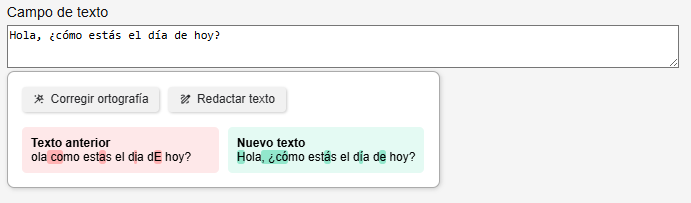
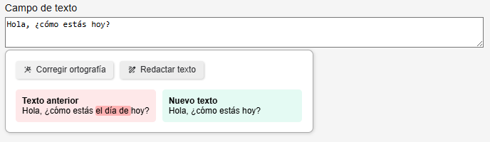

## Avances de esta semana: Corrector de texto inteligente

Durante esta semana se trabajó en el desarrollo y modularización del **corrector de texto con inteligencia artificial** logrando mejoras en su funcionamiento, escalabilidad y usabilidad:

## Refactorización modular

* Se refactorizó el corrector para hacerlo **más limpio, portátil y reutilizable** en cualquier espacio de la plataforma.
* El módulo ahora encapsula toda su lógica, lo que permite fácilmente **activar o desactivar su uso por usuario**.

## Aplicación dinámica en la plataforma

El corrector se aplica automáticamente a todos los `input` y `textarea` de la plataforma que cumplan con los siguientes criterios:

  * Son de tipo `text` o no tienen atributo `type`.
  * **No están dentro de formularios de login** (`#login-form`).
  * **No tienen `name` que termine en `[limitAt]` ni `id` que termine en `_limitAt`**.
  * No son botones, ni campos numéricos, ni calendarios (`datepicker`).

Esta selección se realiza con **jQuery y filtros personalizados**, añadiendo la clase `corrector` únicamente a los campos válidos.

## Control por lista de usuarios

Solo los usuarios autorizados verán el corrector en la plataforma. Esto se gestiona mediante una lista personalizada, por ejemplo:

```javascript
var allowedUsers = [
  'usuario1@sintecto.com',
  'usuario2@sintecto.com',
  'usuario3@sintecto.com',
];
```

El usuario actual se obtiene desde Yii y se normaliza a minúsculas para hacer la comparación.

## Funcionamiento del corrector

* Al detectar un campo con clase `corrector`, se **inyecta dinámicamente una estructura HTML** que lo rodea y le da vida al componente visual.
* Se utilizan **estilos CSS personalizados** para mostrar una interfaz clara y liviana.
* Se agregan **botones flotantes** con acciones como:

    * Corrección ortográfica.
    * Mejora/redacción del texto.

* Al presionar la versión anterior o la nueva del texto (marcada en rojo o verde), se reemplaza automáticamente el contenido actual del campo de formulario con la selección.
* Los botones flotantes o el menú solo se muestran cuando el campo contiene texto; si está vacío, permanecen ocultos incluso al hacer posicionar el cursor encima del campo, activándose únicamente al detectar contenido.

## Ejemplos

### Función de corrección ortográfica


### Función de mejora/redacción de texto


### Conteo de tokens acumulados

Para llevar un control del consumo de tokens, se integró un mecanismo de registro y acumulación en un fichero de logs, Esto permite auditar el uso y tomar decisiones de optimización o costes según el volumen de llamadas.

### Integración con APIs externas

* Al presionar un botón, se realiza una **petición AJAX al controlador PHP**, que se encarga de comunicarse con la API de IA.
* Se está trabajando en preparar la arquitectura para que pueda soportar **múltiples proveedores** (OpenAI, DeepSeek, Google, etc.), cada uno con su lógica encapsulada en un módulo específico iniciando con OpenAi.
* Esto permitirá que **otros desarrollos con IA** en la plataforma también sigan este modelo: mantenible, flexible y escalable en el tiempo.
