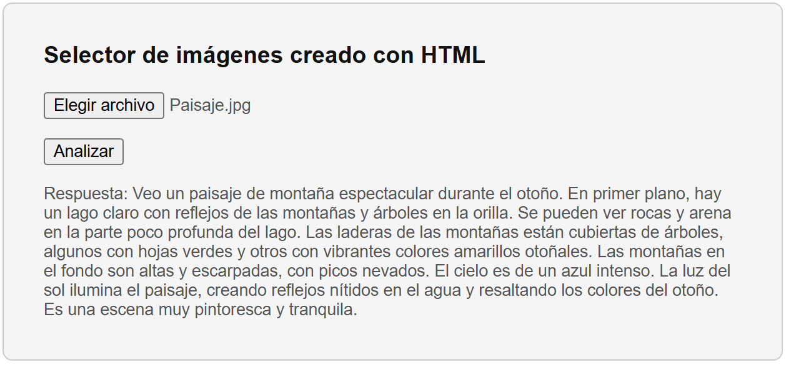

# Avances del corrector de texto basado en IA

## Mejoras de diseño y experiencia de usuario

Durante esta semana se realizaron varias optimizaciones visuales y de usabilidad en la herramienta de corrección de texto:

* Se ajustaron los **colores, márgenes y disposición general de los elementos** para lograr una interfaz más limpia y agradable.
* El diseño ahora es **completamente responsivo**, adaptándose mejor a distintos tamaños de pantalla.
* Se resolvió un detalle visual que generaba **líneas vacías no deseadas** al interactuar con los cuadros de texto del contenido original o corregido.

## Nuevas funcionalidades

* Se añadieron **botones adicionales** con prompts personalizados, permitiendo aplicar distintos estilos o tipos de corrección con un solo clic.
* En caso de que el modelo devuelva un error, ahora se muestra un **mensaje amigable y claro al usuario**, en lugar del área de resultados en blanco o con fallos.

## Mejora en la gestión de proveedores de IA

* Se centralizó la **configuración de proveedor y modelo** desde el controlador (`CorrectorController`) mediante la clase `AiProviderFactory`, facilitando la reutilización y el mantenimiento del código.
* Se implementó un sistema de **generación dinámica de proveedor alternativo**: si se presenta un error (como límite de peticiones), el sistema intenta automáticamente usar otra instancia del mismo proveedor con diferente modelo, o incluso cambiar de proveedor.

## Límite de tiempo de uso (Opcional)

- Se incorporó un cronómetro opcional que limita el tiempo de uso del corrector para usuario independiente, (no global), deshabilitando los botones hasta que se alcanza el tiempo establecido, pensado para optimizar recursos y prevenir un uso excesivo. 

- Esta función puede desactivarse fácilmente estableciendo el tiempo en cero.

    
    - Ejemplo del cronómetro establecido en 60 segundos.

## Documentación

La documentación completa del corrector de texto incluyendo su funcionamiento, diagramas generales de la arquitectura y una visión global de cómo está distribuido el sistema para lograr el servicio de corrección se está llevando en esta página y continúa en proceso de complementación:

- https://saanrm.github.io/notas-sintecto/IA/Proyectos/CorrectorDeTexto

## Módulo de comprensión de imágenes

Durante esta semana se trabajó en las bases del nuevo módulo de comprensión de imágenes, integrándolo dentro de la misma arquitectura de proveedores de IA:

* **Reutilización de la infraestructura existente**: se aprovechó la `AiProviderFactory` y la jerarquía de `AbstractAiProvider` para incorporar en los proveedores de Google y OpenAI la capacidad de procesar imágenes como parámetro adicional en la solicitud JSON además de la de recibir texto por defecto.

* **Gestión dinámica de proveedores**: al igual que en el corrector de texto, si el proveedor usado reporta un error (por ejemplo, límite de peticiones o tiempo de espera agotado), el sistema alterna automáticamente a otra instancia del mismo servicio con un modelo distinto, o bien cambia de proveedor para garantizar continuidad de servicio.

* **Formato unificado de entrada**: las imágenes se envían codificadas en base64 junto con un prompt de texto, permitiendo al modelo recibir ambos elementos en una única petición y devolver una respuesta basandose en los 2 elementos (anotaciones, descripciones o comentarios).

Con estos avances, el sistema evoluciona hacia una solución integral de corrección y análisis de contenidos multimodales, manteniendo la coherencia interna del código y la facilidad de mantenimiento.

### Recursos que se están revisando:

Google ofrece documentación útil para diseñar mejores prompts y comprender en mayor profundidad el funcionamiento de los modelos. Estos recursos incluyen estrategias y ejemplos que permiten obtener respuestas más precisas y eficaces:

- [Diseño de prompts multimodales](https://cloud.google.com/vertex-ai/generative-ai/docs/multimodal/design-multimodal-prompts)
- [Estrategias de prompting](https://cloud.google.com/vertex-ai/docs/multimodal/overview)

## Ejemplo del funcionamiento actual:

### Imágen ingresada:

### Respuesta del modelo:

