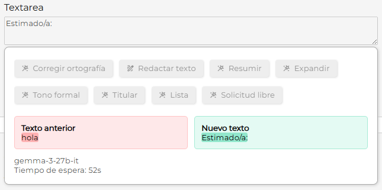

# Avances del corrector de texto basado en IA

## Mejoras de diseño y experiencia de usuario

Durante esta semana se realizaron varias optimizaciones visuales y de usabilidad en la herramienta de corrección de texto:

* Se ajustaron los **colores, márgenes y disposición general de los elementos** para lograr una interfaz más limpia y agradable.
* El diseño ahora es **completamente responsivo**, adaptándose mejor a distintos tamaños de pantalla.
* Se resolvió un detalle visual que generaba **líneas vacías no deseadas** al interactuar con los cuadros de texto del contenido original o corregido.

## Nuevas funcionalidades

* Se añadieron **botones adicionales** con prompts personalizados, permitiendo aplicar distintos estilos o tipos de corrección con un solo clic.
* En caso de que el modelo devuelva un error, ahora se muestra un **mensaje amigable y claro al usuario**, en lugar del área de resultados en blanco o con fallos.

## Mejora en la gestión de proveedores de IA

* Se centralizó la **configuración de proveedor y modelo** desde el controlador (`CorrectorController`) mediante la clase `AiProviderFactory`, facilitando la reutilización y el mantenimiento del código.
* Se implementó un sistema de **generación dinámica de proveedor alternativo**: si se presenta un error (como límite de peticiones), el sistema intenta automáticamente usar otra instancia del mismo proveedor con diferente modelo, o incluso cambiar de proveedor.
* Se incorporó **concurrencia en la solicitud de respuestas** a distintos modelos y proveedores disponibles, mejorando significativamente el tiempo de respuesta del corrector cuando hay múltiples proveedores habilitados.

## Límite de tiempo de uso

- Se incorporó un cronómetro opcional que limita el tiempo de uso del corrector deshabilitando los botones hasta que se alcanza el tiempo establecido, pensado para optimizar recursos y prevenir un uso excesivo. 

- Esta función puede desactivarse fácilmente estableciendo el tiempo en cero.

    
    - Ejemplo del cronómetro establecido en 60 segundos.

## Documentación

La documentación completa del corrector de texto incluyendo su funcionamiento, diagramas generales de la arquitectura y una visión global de cómo está distribuido el sistema para lograr el servicio de corrección se está llevando en esta página y continúa en proceso de complementación:

- https://saanrm.github.io/notas-sintecto/IA/Proyectos/CorrectorDeTexto