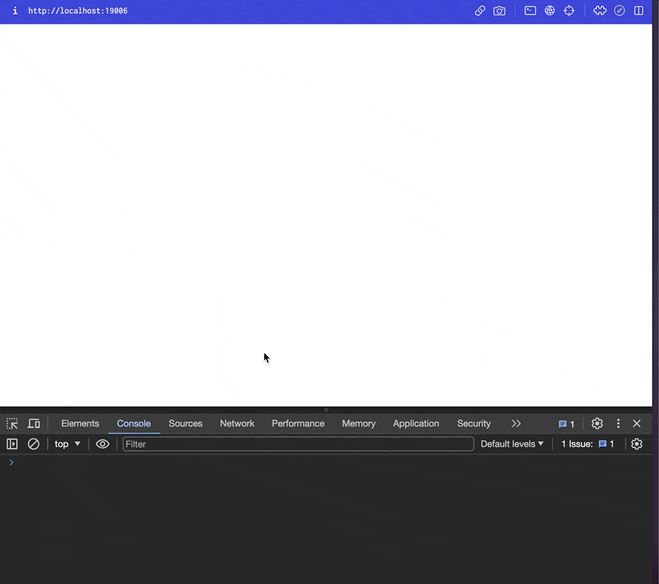

#### Documentación oficial: https://platform.openai.com/docs/guides/streaming-responses?api-mode=chat

# Respuestas en streaming de la API de OpenAI

Este mecanismo permite procesar o mostrar de forma inmediata los fragmentos de salida generada por el modelo, sin tener que esperar a que se complete por completo la respuesta antes de recibirla.




## Habilitación del streaming

Para activar el envío progresivo de la respuesta, basta con incluir el parámetro `stream=True` al invocar los endpoints de Chat Completions o de Completions heredados. De este modo, la API devuelve un flujo de eventos del tipo Server-Sent Events (SSE), enviando fragmentos (“chunks”) de datos a medida que se generan.

### Ejemplo en JavaScript

```javascript
import OpenAI from "openai";
const openai = new OpenAI();

const stream = await openai.chat.completions.create({
    model: "gpt-4.1",
    messages: [
        { role: "user", content: "Di 'baño de burbujas doble' diez veces rápido." }
    ],
    stream: true,
});

for await (const chunk of stream) {
    console.log(chunk);                       // Objeto completo del fragmento
    console.log(chunk.choices[0].delta);      // Sólo el delta generado
    console.log("****************");
}
```

### Ejemplo en Python

```python
from openai import OpenAI
client = OpenAI()

stream = client.chat.completions.create(
    model="gpt-4.1",
    messages=[{ "role": "user", "content": "Di 'baño de burbujas doble' diez veces rápido." }],
    stream=True,
)

for chunk in stream:
    print(chunk)                              # Objeto completo del fragmento
    print(chunk.choices[0].delta)             # Sólo el delta generado
    print("****************")
```

## Lectura de los fragmentos

Cuando se recibe cada fragmento, en lugar de un campo `message`, aparece un campo `delta` que contiene:

* Un token de rol (p. ej., `"assistant"`) en el primer fragmento.
* Un token de contenido en cada fragmento subsiguiente (o ninguno, si corresponde).

Ejemplo de secuencia de `delta`:

```text
{ role: 'assistant', content: '', refusal: null }
****************
{ content: '¿Por' }
****************
{ content: 'qué' }
****************
{ content: ' los' }
****************
{ content: ' átomos' }
****************
{ content: ' no' }
****************
{ content: ' confían' }
****************
{ content: ' en' }
****************
{ content: ' nada' }
****************
{ content: '?' }
****************
{ content: ' Porque' }
****************
{ content: ' lo' }
****************
{ content: ' forman' }
****************
{ content: ' todo' }
****************
{ content: '!' }
****************
{ }
****************
```

### Procesar sólo el texto

Para imprimir únicamente el texto generado, se filtra cada fragmento por `delta.content`, por ejemplo:

```javascript
for await (const chunk of stream) {
    process.stdout.write(chunk.choices[0]?.delta?.content || "");
}
```

```python
for chunk in stream:
    if chunk.choices[0].delta.content is not None:
        print(chunk.choices[0].delta.content, end="")
```

## Casos de uso avanzados

Para necesidades más especializadas, como:

* Transmisión de llamadas a funciones (tool calls).
* Salida estructurada en streaming.

se dispone de guías específicas en la documentación oficial.

## Riesgos de moderación

Al exponer fragmentos parciales de la salida en producción, resulta más complejo realizar evaluaciones de contenido y aplicar filtros de moderación. Esto puede requerir un análisis adicional para garantizar el cumplimiento de las políticas de uso.
