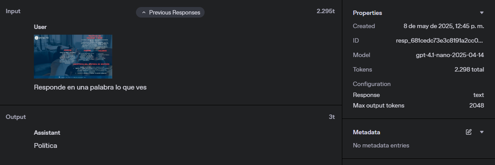

# Imágenes y visión

#### Documentación oficial: https://platform.openai.com/docs/guides/images-vision?api-mode=responses

### Descripción general

La API de OpenAI permite construir aplicaciones que involucran imágenes. Las capacidades de visión permiten procesar entradas visuales, y los modelos también pueden generar imágenes. 

### Casos de uso relacionados con imágenes

Los modelos recientes pueden analizar imágenes (capacidad conocida como **visión**) y generar imágenes con el modelo `gpt-image-1`.

La API ofrece varios endpoints para procesar imágenes como entrada o generarlas como salida:

| API                  | Casos de uso soportados                                                                      |
| -- | -- |
| Chat Completions API | Analizar imágenes y usarlas como entrada para generar texto o audio                          |
| Responses API        | Analizar imágenes como entrada para generar texto (el soporte para generación vendrá pronto) |
| Images API           | Generar imágenes como salida, con la opción de usar imágenes como entrada                    |

Para más detalles sobre las modalidades de entrada y salida, se puede consultar la [página de modelos](https://platform.openai.com/docs/models).


## Generación o edición de imágenes

Las imágenes pueden generarse o editarse mediante la Images API. Próximamente también se podrá hacer esto mediante la Responses API.

El modelo más reciente, `gpt-image-1`, es multimodal de forma nativa. Puede comprender texto e imágenes, y generar imágenes con mayor precisión contextual y siguiendo mejor las instrucciones.

También se ofrecen modelos especializados como **DALL·E 2** y **DALL·E 3**, que no poseen el mismo nivel de comprensión del mundo que GPT Image.

### Uso del conocimiento del mundo para la generación de imágenes

GPT Image, al ser multimodal, puede utilizar su comprensión visual del mundo para generar imágenes realistas sin referencias directas. Por ejemplo, al pedirle que genere un gabinete con piedras semipreciosas populares, puede incluir amatista, cuarzo rosa, jade, etc., y representarlas de forma realista.


## Análisis de imágenes

La **visión** permite al modelo "ver" y comprender imágenes, incluido el texto que contengan. También puede reconocer objetos, formas, colores y texturas, aunque con ciertas [limitaciones](#limitaciones).

### Proporcionar imágenes como entrada

Las imágenes pueden enviarse como URL o como datos codificados en Base64.

#### Enviar una URL

Ejemplo en Python:

```python
response = client.chat.completions.create(
  model="gpt-4.1-mini",
  messages=[{
    "role": "user",
    "content": [
      {"type": "text", "text": "¿Qué hay en esta imagen?"},
      {
        "type": "image_url",
        "image_url": {
          "url": "https://upload.wikimedia.org/wikipedia/commons/thumb/d/dd/Gfp-wisconsin-madison-the-nature-boardwalk.jpg/2560px-Gfp-wisconsin-madison-the-nature-boardwalk.jpg",
        },
      },
    ],
  }],
)
```

#### Enviar imagen en Base64

Ejemplo en Python:

```python
def encode_image(image_path):
    with open(image_path, "rb") as image_file:
        return base64.b64encode(image_file.read()).decode("utf-8")

base64_image = encode_image("ruta_a_la_imagen.jpg")

completion = client.chat.completions.create(
  model="gpt-4.1",
  messages=[
    {
      "role": "user",
      "content": [
        { "type": "text", "text": "¿Qué hay en esta imagen?" },
        {
          "type": "image_url",
          "image_url": {
            "url": f"data:image/jpeg;base64,{base64_image}",
          },
        },
      ],
    }
  ],
)
```


## Requisitos de las imágenes de entrada

| Requisito              | Detalles                                                             |
| - | -- |
| Tipos de archivo       | PNG, JPEG, WEBP, GIF (no animado)                                    |
| Tamaño máximo          | Hasta 20 MB por imagen                                               |
| Resolución             | Baja: 512×512 px / Alta: hasta 768×2000 px (lado corto × lado largo) |
| Requisitos adicionales | Sin marcas de agua, logotipos, texto o contenido NSFW; imagen clara  |

### Nivel de detalle

El parámetro `detail` permite definir el nivel de detalle al analizar la imagen:

```json
"image_url": {
  "url": "https://...jpg",
  "detail": "high"
}
```

Valores posibles: `"low"`, `"high"`, o `"auto"` (predeterminado).

* `low`: usa una versión reducida de la imagen (512×512 px), ideal para ahorrar tokens.
* `high`: permite mayor precisión visual, útil para tareas que requieren análisis detallado.


## Limitaciones

Algunas limitaciones conocidas de los modelos con capacidades visuales:

* **Imágenes médicas**: no están diseñados para interpretar imágenes médicas especializadas (como tomografías) ni para ofrecer consejos médicos.
* **Texto en otros idiomas**: el rendimiento puede ser inferior con alfabetos no latinos (como japonés o coreano).
* **Texto pequeño**: si hay texto pequeño en la imagen, puede que no se reconozca correctamente a menos que se amplíe.

## Cálculo de costos

Las entradas de imagen se miden y cobran en tokens, al igual que las entradas de texto. La forma en que las imágenes se convierten en tokens de texto varía según el modelo.

#### Modelos GPT-4.1-mini, GPT-4.1-nano, o4-mini

Las entradas de imagen se cobran en tokens de acuerdo con sus dimensiones. El costo en tokens de una imagen se determina del siguiente modo:

1. Se calcula cuántos bloques de 32px x 32px se requieren para cubrir la imagen completamente (Parches de 32px).
2. Si el número de bloques excede los 1536, la imagen se redimensiona para que pueda cubrirse con un máximo de 1536 bloques, manteniendo la proporción.
3. El costo en tokens corresponde al número de bloques, con un tope de 1536 tokens.

Para el cálculo total:

* En el caso de GPT-4.1-mini, se multiplica por 1.62.
* En GPT-4.1-nano, por 2.46.
* En o4-mini, por 1.72.

Esto se factura como si fueran tokens de texto normales.

**Ejemplos:**

Una imagen de 1024 x 1024 consume 1024 tokens:

  - Ancho: (1024 + 32 - 1) // 32 = 32
  - Alto: (1024 + 32 - 1) // 32 = 32
  - Tokens: 32 \* 32 = 1024 (debajo del tope de 1536)

Una imagen de 1800 x 2400 genera inicialmente 4275 bloques (57 x 75), lo cual excede el límite.

Se escala la imagen con un factor de reducción:
  - `sqrt((1536 * 32^2) / (1800 * 2400)) = 0.603`

  Luego, se ajusta nuevamente el ancho para tener 33 bloques:
  - Factor adicional de escala: 33 / 33.94 = 0.97
  - Tamaño final: 1056 x 1408
  - Parches: 33 \* 44 = 1452 tokens (bajo el tope)


#### Modelos GPT-4o, GPT-4.1, GPT-4o-mini, CUA y serie o (excepto o4-mini)

El costo en tokens se calcula considerando dos factores: tamaño y nivel de detalle.

Para calcular el costo:

1. Se escala la imagen para que encaje en un cuadrado de 2048px x 2048px, manteniendo la proporción.
2. Se ajusta la imagen para que su lado más corto mida 768px.
3. Se cuenta el número de bloques de 512px x 512px (cada bloque tiene un costo específico).
4. Se suma una cantidad base de tokens, que depende del modelo.

    | Modelo               | Tokens base | Tokens por bloque |
    | -- | -- | -- |
    | 4o, 4.1, 4.5         | 85          | 170               |
    | 4o-mini              | 2833        | 5667              |
    | o1, o1-pro, o3       | 75          | 150               |
    | computer-use-preview | 65          | 129               |

**Ejemplos para GPT-4o:**

### Imagen 1024 x 1024, con detalle "alto":
  
No requiere primer redimensionamiento (menor a 2048).
  - Se redimensiona a 768 x 768.
  - Requiere 4 bloques de 512px.
  - Costo: 4 \* 170 + 85 = **765 tokens**

* Imagen 2048 x 4096, detalle "alto":
  - Se redimensiona a 1024 x 2048, luego a 768 x 1536.
  - Requiere 6 bloques.
  - Costo: 6 \* 170 + 85 = **1105 tokens**

* Imagen 4096 x 8192, detalle "bajo":
  - Independientemente del tamaño, el costo es fijo.
  - Costo: **85 tokens**


#### Modelo GPT Image 1

Este modelo sigue el mismo cálculo, salvo que la imagen se escala para que el lado más corto tenga **512px** (en lugar de 768px). No se utiliza configuración de detalle.

* Costo base: **65 tokens**
* Por cada bloque de 512px: **129 tokens**


Todas las imágenes se procesan a nivel de token, y cada imagen cuenta para el límite de tokens por minuto (TPM).

## Ejemplo real:



| Paso                         | Resultado           |
| ---------------------------- | ------------------- |
| Tamaño imagen                | 1280 × 720 px       |
| Parches de 32px              | 40 × 23 = 920       |
| Multiplicador (GPT-4.1-nano) | × 2.46              |
| Tokens estimados             | 920 × 2.46 = \~2263 |
| Tokens facturados (redondeo) | **2298**            |

### URL del ejemplo: 
- https://platform.openai.com/logs/resp_681cedc73e3c8191a2cc0a193c0fcf6007614bdc9bcf311a