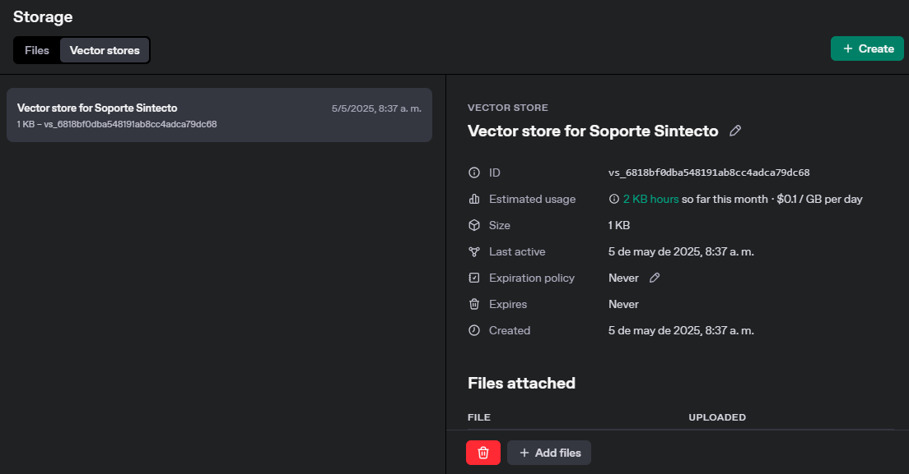
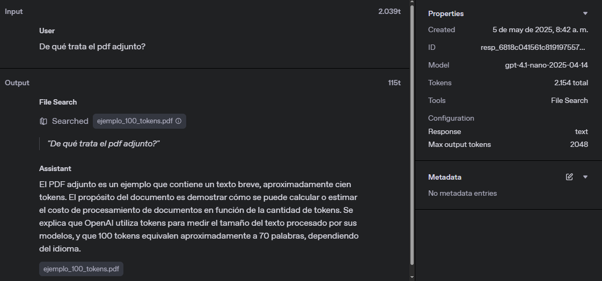

## ¿Qué es File Search?

File Search es una herramienta que permite cargar documentos (por ejemplo, PDFs, archivos Word, TXT) para que el modelo de OpenAI pueda buscar y recuperar automáticamente fragmentos relevantes en función de una consulta.  

A diferencia del enfoque manual, en el cual es necesario copiar y pegar el contenido directamente en el prompt, File Search indexa los documentos y realiza búsquedas inteligentes sobre ellos, esta funcionalidad resulta especialmente útil para gestionar grandes volúmenes de información o múltiples documentos, permitiendo una recuperación de datos más eficiente y precisa.

## Comparación entre usar File search o ingresar manualmente el texto del archivo

Se creó un archivo PDF con un contenido de aproximadamente 100 Tokens con el propósito de comparar el uso de tokens al usar **File Search** con el de **ingresar manualmente el texto** del archivo.

El archivo PDF es el siguiente: [Ejemplo_100_tokens.pdf](ejemplo_100_tokens.pdf).

### 1. Subir archivo a OpenAI

En este caso, el documento se cargó en la plataforma de OpenAI a través del dashboard (https://platform.openai.com/storage) pero también es posible subir documentos utilizando:
- La API **/v1/files** (https://platform.openai.com/docs/api-reference/files)

Cuando se usa una herramienta como el file search de OpenAI se lleva a cabo un proceso de indexación que incluye la creación de un almacenamiento vectorial, este proceso consiste en dividir el contenido del archivo en fragmentos y convertir cada uno de ellos en una representación matemática llamada **vector de embedding**. Estos vectores permiten realizar búsquedas semánticas eficientes y precisas dentro del contenido del archivo.

La creación del almacenamiento vectorial es fundamental para que el modelo pueda interpretar el contenido del archivo de forma contextual. En lugar de procesar todo el documento de manera secuencial, el modelo utiliza estos vectores para identificar y recuperar las secciones más relevantes según la consulta realizada. Esto optimiza el rendimiento y mejora la calidad de las respuestas generadas.

:::info
El almacenamiento de vectores tiene un costo de $0.1 por cada GB de almacenamiento por dia.

| Almacenamiento | Cálculo                  | Costo mensual |
|---------------:|--------------------------|--------------:|
| 1 GB           | 0,10 × 30 días × 1 GB    | $3,00         |
| 50 GB          | 0,10 × 30 días × 50 GB   | $150,00       |
| 100 GB         | 0,10 × 30 días × 100 GB  | $300,00       |

:::

### 2. LLamada a la Api con File Search

| Ejecución | Tokens de entrada | Tokens de salida | Total de tokens |
|--|--|--|--|
| **1**     | 2.039             | 115              | **2.154**        |

### 3. LLamada a la Api ingresando manualmente el texto del archivo

| Ejecución | Tokens de entrada | Tokens de salida | Total de tokens |
|--|--|--|--|
| **1**     | 95             | 84              | **179**        |

## Conclusiones

**File Search** es ideal para consultas repetidas o documentos grandes, ya que:

  * Solo cobra por los tokens de los chunks relevantes.
  * Permite búsquedas semánticas avanzadas.
  * **Sin embargo**, además del costo de almacenamiento del vector store, **se paga por el procesamiento** que incluye parseo, chunking y generación de embeddings, lo cual puede incrementar el costo total en comparación con la inyección manual de texto.

**Inyección manual** funciona para documentos muy cortos o consultas puntuales, ya que:

  * No requiere vector store ni indexación previa.
  * Sólo se paga por los tokens del prompt y la respuesta.
  * Evita cargos adicionales por procesamiento de archivos.

**Recomendación:**

* Si el documento es muy grande y requiere búsquedas avanzadas, usar File Search.
* Si el documento es corto o la consulta es puntuante, usar la inyección manual.