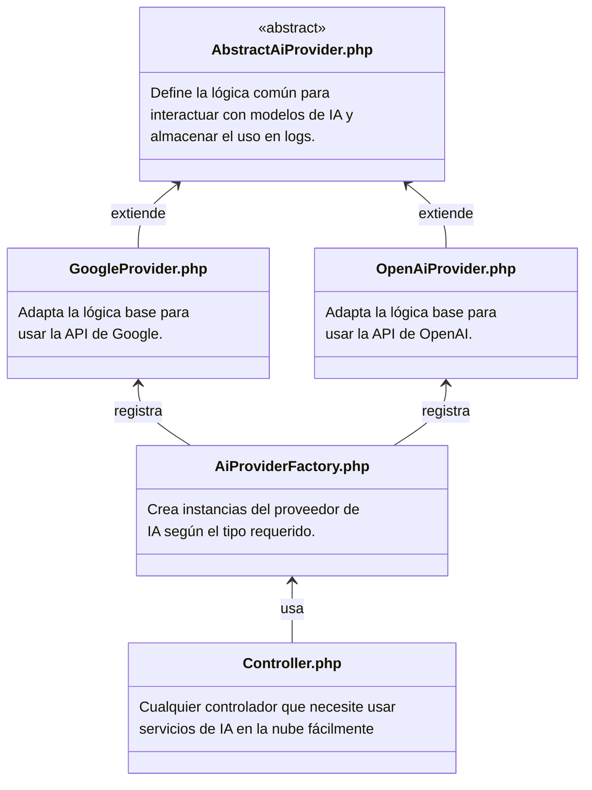

## Backend 

El backend está construido con una estructura orientada a objetos que promueve la extensibilidad y la reutilización de código. A continuación, se explica la estructura basada en el siguiente diagrama:

