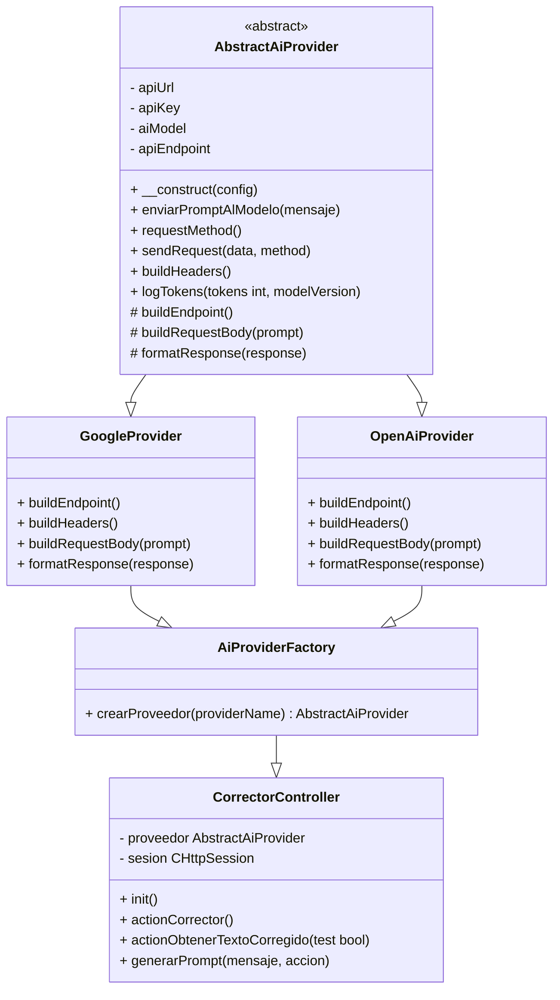

---
title Corrector de texto 
sidebar_position 1
---

Proyecto de corrector de texto

```mermaid

classDiagram
    direction TB

    %% Clase abstracta base
    class AbstractAiProvider {
        <<abstract>>
        - apiUrl
        - apiKey
        - aiModel
        - apiEndpoint
        + __construct(config)
        + enviarPromptAlModelo(mensaje)
        + requestMethod()
        + sendRequest(data, method)
        + buildHeaders()
        + logTokens(tokens int, modelVersion) 
        # buildEndpoint()
        # buildRequestBody(prompt)
        # formatResponse(response)
    }

    AbstractAiProvider --|> GoogleProvider
    AbstractAiProvider --|> OpenAiProvider

    %% Proveedores concretos
    class GoogleProvider {
        + buildEndpoint()
        + buildHeaders()
        + buildRequestBody(prompt)
        + formatResponse(response)
    }

    class OpenAiProvider {
        + buildEndpoint()
        + buildHeaders()
        + buildRequestBody(prompt)
        + formatResponse(response)
    }

    GoogleProvider --|> AiProviderFactory
    OpenAiProvider --|> AiProviderFactory

    %% Fábrica de proveedores
    class AiProviderFactory {
        + crearProveedor(providerName) AbstractAiProvider
    }

    AiProviderFactory --|> CorrectorController

    %% Controlador de corrección
    class CorrectorController {
        - proveedor AbstractAiProvider
        - sesion CHttpSession
        + init() 
        + actionCorrector() 
        + actionObtenerTextoCorregido(test bool) 
        + generarPrompt(mensaje, accion)
    }

```

