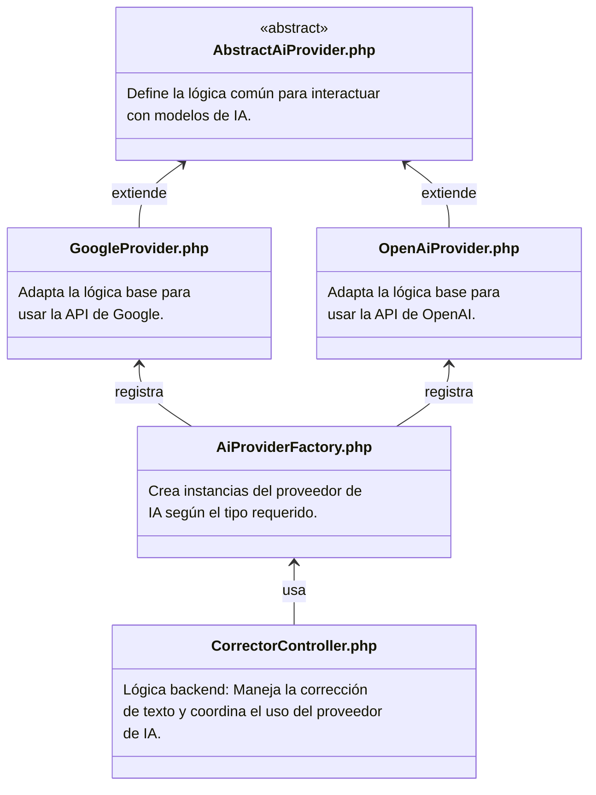
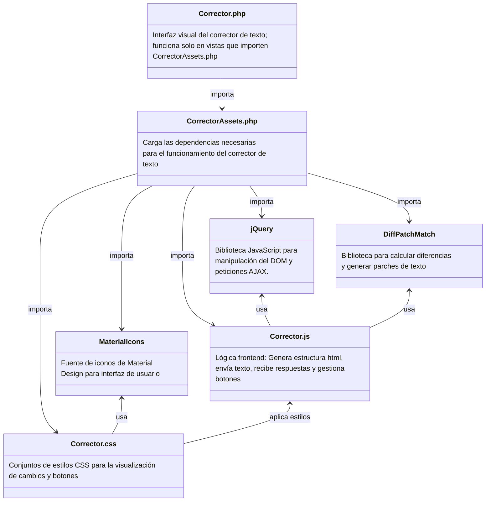
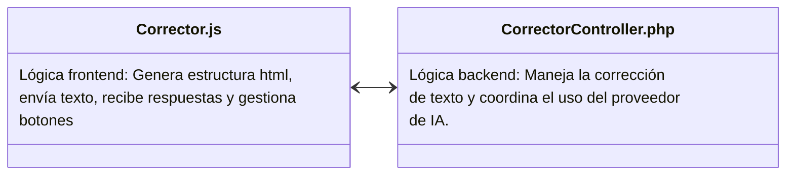

# Corrector de texto

El **Corrector de texto** es una herramienta que permite identificar y sugerir correcciones ortográficas o de redacción en fragmentos de texto. Su diseño modular permite la integración con múltiples proveedores de inteligencia artificial, facilitando el mantenimiento y la extensión del sistema. La arquitectura del proyecto se divide en dos grandes componentes: el **backend**, responsable del procesamiento y la comunicación con los proveedores de IA, y el **frontend**, que gestiona la interfaz de usuario y la interacción con el sistema.

## Backend 

El backend está construido con una estructura orientada a objetos que promueve la extensibilidad y la reutilización de código. A continuación, se explica la estructura basada en el siguiente diagrama:

### Descripción técnica
- **AbstractAiProvider.php**: Clase abstracta que define una interfaz común para todos los proveedores de IA. Permite estandarizar las operaciones independientemente del proveedor específico.

- **GoogleProvider.php** y **OpenAiProvider.php**: Implementaciones concretas que adaptan la lógica para comunicarse con las APIs respectivas de Google y OpenAI.

- **AiProviderFactory.php**: Implementa el patrón Factory. Esta clase es responsable de instanciar el proveedor correspondiente según una configuración o solicitud.

- **CorrectorController.php**: Es el punto de entrada del backend. Recibe solicitudes del frontend, obtiene el texto a corregir, utiliza la fábrica para elegir el proveedor y retorna la respuesta procesada.

## Frontend

El frontend gestiona la experiencia del usuario, generando dinámicamente la interfaz del corrector, comunicándose con el backend y presentando los cambios sugeridos.

### Descripción técnica

- **Corrector.php**: Plantilla de vista principal del corrector. Solo se activa cuando se importan sus recursos `CorrectorAssets.php`.
- **CorrectorAssets.php**: Clase que encapsula todos los recursos necesarios del frontend (scripts, estilos, librerías).
- **Corrector.js**: Script principal que construye dinámicamente la interfaz, envía el texto ingresado al backend y presenta la respuesta del modelo.
- **DiffPatchMatch**: Biblioteca externa especializada en mostrar diferencias entre textos originales y corregidos.
- **Corrector.css**: Archivo de estilos para marcar visualmente las correcciones y demás elementos de la interfaz.
- **jQuery**: Usado para operaciones DOM y AJAX.
- **MaterialIcons**: Conjunto de íconos que mejora la experiencia visual del usuario.

## Conexión del frontend con el backend

La conexión entre ambos componentes se realiza mediante llamadas AJAX realizadas por el JavaScript del frontend hacia el controlador backend.

### Descripción técnica

Cuando el usuario ingresa un texto y pulsa el botón de corrección, Corrector.js envía una solicitud AJAX al CorrectorController.php.

- El controlador procesa la solicitud, escoge el proveedor de IA adecuado mediante la AiProviderFactory.php, y devuelve la respuesta con el texto corregido.
- El frontend interpreta y muestra los cambios utilizando la biblioteca DiffPatchMatch, resaltando lo que fue corregido.