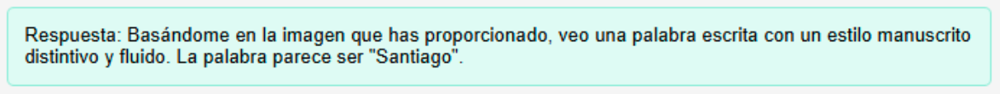
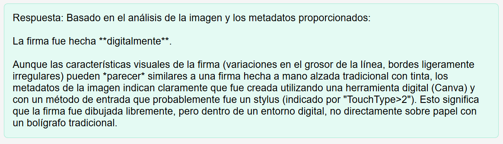
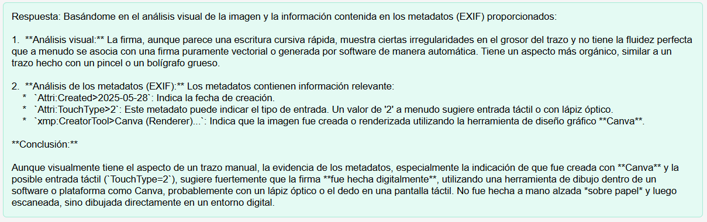
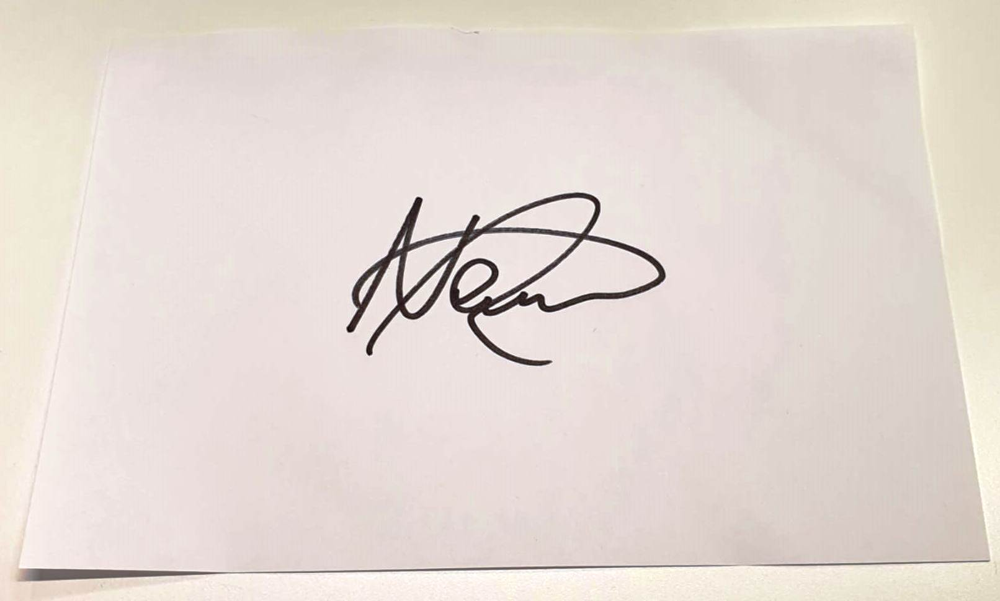

# Visión de Imágenes

Este apartado presenta ejemplos reales de respuestas generadas mediante un módulo de inteligencia artificial para visión de imágenes. Las pruebas se realizaron enviando distintas imágenes junto con prompts específicos. Se implementaron dos botones funcionales: **Analizar firma** y **Describir imagen**, cada uno asociado a un prompt diferente.

## 1. Análisis general de la imagen

Este análisis corresponde a la respuesta generada al presionar el botón **Analizar firma**, que envía la imagen junto con el siguiente prompt:

> *“¿Qué ves en la imagen?: (Imagen)”*

## 2. Determinación del tipo de firma

Este segundo análisis se obtiene al presionar el botón **Describir imagen**, ejecutando el siguiente prompt:

> *“Analiza la imagen y determina si la firma fue hecha a mano alzada o digitalmente.”*

## Ejemplo 1: Firma digital realizada a mano alzada

### Imagen utilizada:

### Contexto:

Se utilizó la misma imagen en ambos análisis. Corresponde a una firma creada digitalmente a mano alzada utilizando una tableta gráfica. La firma original estaba en formato PNG (con fondo transparente), pero fue editada en Canva para agregarle un fondo y exportarla en formato JPG.

### Resultado 1 – Análisis general:

### Resultado 2 – Descripción de la imagen:

### Conclusiones:

* Los modelos de visión de imágenes suelen interpretar mejor imágenes con fondo uniforme, ya que esto facilita la identificación de los elementos presentes.
* En imágenes PNG con fondo transparente y elementos oscuros (como firmas negras), algunos modelos pueden interpretar el fondo como negro, haciendo que el contenido se mezcle y sea indetectable.
* Agregar un fondo a las imágenes mejora significativamente la precisión del análisis, al generar el contraste necesario para diferenciar los elementos.
* Además del contenido visual, el modelo puede tener en cuenta metadatos implícitos (como resolución, formato o paleta de colores), lo que contribuye a generar respuestas más detalladas y precisas.

## Ejemplo 2: Firma hecha en papel

### Contexto:

En este caso, se utilizó una imagen de una firma realizada con bolígrafo sobre papel blanco. La claridad del fondo y la nitidez del trazo facilitan el reconocimiento y análisis por parte del modelo de visión.
